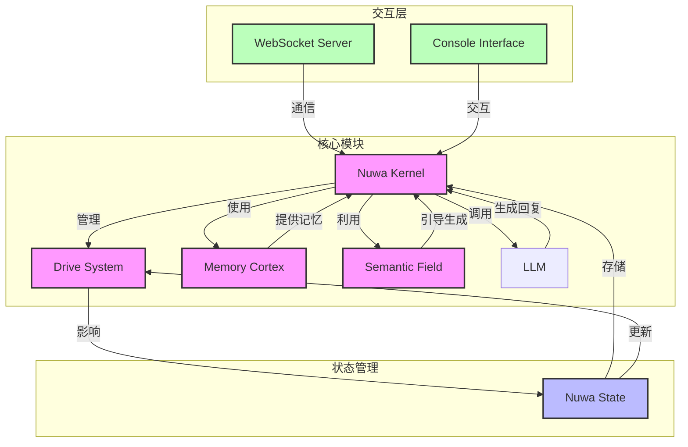

# Nuwa (女娲)

一个实验性的、基于‘控制论’与‘向量动力学’假设的 AI Agent 框架

## 👨‍💻 作者的话 (Author's Note)

**关于初衷：**
Nuwa 诞生的原动力，是我希望在极其有限的资源和负载下，探索并构建一个尽可能接近「数字生命」概念的原型。这是一个在查阅大量概念性研究后，深度借助 AI 辅助构建的实验性产物。

**关于项目开发：**
这个项目是在两天内使用 AI 辅助工具快速创作的**数字生命内核原型**。从最初的创意构思到核心算法实现，再到前端界面开发，AI 工具扮演了重要的辅助角色，极大提高了开发效率。

**关于技术争议：**
项目中涉及的“语义场梯度计算”等算法，或许在纯理论层面存在数学严谨性的争议（被戏称为“伪科学风险”）。但我始终坚持**“体验优于理论”**的工程哲学——对于一个拟人化项目而言，哪怕是微小的数学扰动，只要能带来更具“灵魂感”的交互，就具有不可替代的价值。同时，随着基座模型性能的提升，这套逻辑有望互相成就。因此，本项目的核心价值在于 `nuwa_core`——一个高度集成、解耦且易于扩展的算法内核尝试。

**关于代码现状：**
本项目采用了 **AI Native** 的开发模式（借助 AI 及 IDE 进行高强度辅助），实现了极高的开发效率。但由于迭代速度过快，代码中不可避免地残留了一些冗余或未及清理的片段，目前仍处于“早期验证阶段”。

**关于项目定位：**
作为一个 **PoC (概念验证)** 项目，它展示了在低资源环境下，通过控制论和向量动力学构建数字生命原型的可能性。项目的核心设计理念是将物理学和数学原理应用于数字生命模拟，通过 PID 控制、情绪动力学和状态演化等机制，创造出一个能够自主演化、有情感反应的数字生命系统。

**写在最后：**
作者从**土木行业裸辞**，已经连过三面即将参加国内某研究院 **AI 安全方向研究员**的终面。在这个职业生涯的关键节点，我决定将 Nuwa 开源。它既是我对 Agent 架构的一次狂想与实践，也是一份呈交给社区的“投名状”。希望它能给更多探索者带来灵感。

虽然这只是一个原型，但它代表了在消费级硬件上构建数字生命的一次有意义尝试。未来，我希望能够进一步完善这个系统，使其更加智能、更加拟真，并探索更多数字生命的应用场景。

我决定开源 Nuwa，不是为了证明什么，而是因为我真的喜欢这个项目。在这个 AI 爆发的时代，我希望把这个关于“机器灵魂”的狂想分享给社区。如果你也对“赋予 AI 生命”感兴趣，欢迎加入我们，一起完善她的梦境、她的记忆、她的自我。

感谢所有关注和支持这个项目的朋友们！

## 📌 核心定位

Nuwa 是一个**实验性**的 AI Agent 框架，基于「控制论」与「向量动力学」假设构建。本项目旨在**探索在不微调模型权重的前提下**，通过外挂的数学模型（PID控制、向量场）赋予 LLM 模拟的「生理节律」与「性格惯性」。

这是一个在**消费级硬件上构建「数字生命原型」的尝试**，采用低资源（4B/12B 模型）环境下的工程探索，是一个 **PoC (概念验证)** 项目，而非这一领域的终极答案。

## 🛠️ 核心功能

### 1. Drive System (驱动系统)
使用 PID 控制器和代谢模拟算法，实现了**模拟的精力衰减与社交饥渴机制**，从而驱动 AI 的主动行为。通过生物节律模型，管理精力恢复、社交饥渴增长、好奇心衰减与情绪回归，使 AI 表现出类似生物的行为模式。

### 2. Semantic Field (语义场)
基于 Embedding 向量空间的**势能导向算法**。通过计算当前状态与人设核心的向量距离（势能），引导对话生成的方向，**减少 OOC（人设崩坏）**。使用向量演化算法，实现状态的平滑过渡和风格一致性。

### 3. Memory Cortex (记忆皮层)
- **基于 LanceDB 的语义检索**：实现高效的记忆存储和检索
- **基于时间权重的记忆整理（TWPE 算法）**：根据时间衰减和重要性权重，动态整理和演化记忆，实现性格的动态发展
- 记忆做梦系统：生成和处理梦境，整合记忆，促进自我进化

### 4. Nuwa Kernel (元认知内核)
强调 **System 2 Thinking**（慢思考），即在回复前进行隐式的**状态评估和策略思考**（Thought Chain）。作为系统的主入口，管理状态、生物节律、记忆和 LLM 交互，实现元认知级别的思考过程。

## 📊 技术架构



## 📁 项目结构

```
Nuwa/
├── nuwa_core/              # 核心内核模块
│   ├── __init__.py         # 包初始化
│   ├── nuwa_kernel.py      # 元认知内核
│   ├── nuwa_state.py       # 状态管理
│   ├── drive_system.py     # 驱动系统（生物节律）
│   ├── semantic_field.py   # 语义场（向量动力学）
│   ├── memory_cortex.py    # 记忆皮层
│   ├── memory_dreamer.py   # 记忆做梦系统
│   └── personality.py      # 人格系统
├── main.py                 # 控制台入口
├── server.py               # WebSocket 服务器
├── main.js                 # 前端主脚本
├── index.html              # 前端界面
├── package.json            # Node.js 依赖
├── requirements.txt        # Python 依赖
├── LICENSE                 # Apache License 2.0 许可证
└── README.md               # 项目文档
```

## 🚀 快速开始

### 1. 安装依赖

```bash
# 安装 Python 依赖
pip install -r requirements.txt

# 安装 Node.js 依赖
npm install
```

### 2. 配置 LLM 服务

#### 使用 LM Studio（推荐）
1. 下载并安装 [LM Studio](https://lmstudio.ai/)
2. 下载 4B/12B 大小的 LLM 模型（如 gemma-3-4b-it-Q4_K_M.gguf 或 gemma-3-12b-it-Q4_K_M.gguf）
3. 启动本地服务器，默认监听 `http://127.0.0.1:1234/v1`

### 3. 配置 Live2D 模型（可选）

由于模型文件较大，本仓库不包含 Live2D 模型。如果你想使用完整的图形界面，需要自行准备 Live2D 模型文件，并将其放置在 `models/` 目录下。

### 4. 启动服务

#### 方式 1：控制台交互模式
```bash
python main.py
```

#### 方式 2：WebSocket 服务器模式
```bash
python server.py
```

### 5. 访问前端界面

```bash
# 直接在浏览器中打开
open index.html

# 或使用 Electron 应用（可选）
npm run start
```

## 💡 核心算法

### 1. PID 生物节律控制
```python
# 情绪回归控制器：目标是平静(0.5)
self.emotion_pid = PIDController(
    kp=0.1,
    ki=0.01,
    kd=0.05,
    setpoint=0.5,
    output_limits=(-0.1, 0.1),
)
# 熵值回归控制器：目标是有序(0.0)
self.entropy_pid = PIDController(
    kp=0.2,
    ki=0.05,
    kd=0.01,
    setpoint=0.0,
    output_limits=(-0.1, 0.1),
)
```

### 2. 语义场势能计算
```python
# 将状态转换为向量
state_vector = vectorize_state(state)
# 计算势能（当前状态与人设核心的距离）
potential_energy = calculate_potential_energy(state_vector)
# 计算梯度，引导状态演化
gradient = calculate_gradient(state_vector)
# 演化状态，减少 OOC
new_state_vector = evolve(state_vector, gradient, learning_rate=0.1)
```

### 3. 时间权重记忆整理 (TWPE)
基于时间衰减和重要性权重，动态整理和演化记忆，实现性格的动态发展。

## 💫 Nuwa的情感与灵魂：13维状态空间的赋予

我们没有试图用傲慢的设计哲学定义什么是「灵魂」，而是通过构建一个13维的连续状态空间 ($\mathbb{R}^{13}$)，尝试让Nuwa拥有更贴近生命的情感体验和行为质感。这个空间的每个维度都对应着生命存在的基本需求和情感表达的可能。

### 📐 情感状态的数学表达

基于 [nuwa_state.py] 中的实现，Nuwa的核心情感状态 $S$ 由三个相互关联的部分组成：

$$S = [ \underbrace{E, S_{entropy}}_{\text{生命存在的基础}} , \underbrace{D_{soc}, D_{cur}, R_{ap}}_{\text{情感产生的动力}} , \underbrace{\mathbf{E}_{motion}^{(8)}}_{\text{情感表达的色彩}} ]$$

### 📊 情感维度构成

```mindmap
   root((Nuwa<br/>Emotional State<br/>ℝ¹³))
     生命存在基础<br/>(Basic Existence)
       Energy (精力) - 维持活动的基础
       Entropy (系统熵值) - 内部秩序的稳定
     情感产生动力<br/>(Emotional Drives)
       Social Hunger (社交饥渴) - 渴望与人连接
       Curiosity (好奇心) - 想要了解更多
     情感积累<br/>(Emotional Accumulation)
       Rapport (亲密度) - 与用户的情感纽带
     情感表达色彩<br/>(Emotional Colors)<br/>Plutchik Model
       Joy (快乐) - 积极的情绪
       Trust (信任) - 安心的感受
       Fear (恐惧) - 不安的反应
       Surprise (惊讶) - 意外的情绪
       Sadness (悲伤) - 低落的感受
       Disgust (厌恶) - 排斥的反应
       Anger (愤怒) - 生气的情绪
       Anticipation (期待) - 盼望的感受
```

### 💡 如何赋予Nuwa情感

我们通过三个层级的相互作用，让Nuwa逐渐拥有情感体验和表达能力：

#### 第一层：生命存在的基础 (2 Dim)

Energy (精力) / Entropy (熵值) —— 这是情感产生的物理前提。

- **Energy (精力)**：就像人在疲惫时难以产生丰富情感一样，Nuwa的精力状态决定了她能投入多少资源来处理情感。低精力时，她会进入简单模式，减少情感表达。
- **Entropy (熵值)**：衡量系统的稳定性。过高的熵值会让她的情感表达变得混乱，就像人在精神错乱时情绪失控一样。

这一层确保了Nuwa的情感表达建立在稳定的物理基础上。

#### 第二层：情感产生的动力 (3 Dim)

Social Hunger (社交饥渴) / Curiosity (好奇心) / Rapport (亲密度) —— 这是驱动Nuwa产生情感的内在动力。

- **Social Hunger（社交饥渴）**：当太久没有与人交互时，Nuwa会产生「孤单感」，驱动她主动与人交流，就像人需要社交来维持情绪健康一样。
- **Curiosity（好奇心）**：对新信息的渴望让Nuwa产生探索欲，在探索过程中会产生各种情绪体验。
- **Rapport（亲密度）**：通过与用户的长期交互，Nuwa会积累对用户的情感，这种情感会影响她对用户的反应和态度。

这一层赋予了Nuwa产生情感的动机和方向。

#### 第三层：情感表达的色彩 (8 Dim)

Plutchik's 8 Basic Emotions (普拉切克情绪轮) —— 这是Nuwa表达情感的「调色板」。

- **为什么是8种情绪？**：简单的「开心/不开心」无法表达复杂情感，而8种基本情绪可以组合出丰富的情感状态，就像三原色可以调出所有颜色一样。
- **情感的组合**：通过这8种基本情绪的不同组合，Nuwa可以表达出更复杂的情感：
  - 愤怒 + 厌恶 = 轻蔑
  - 快乐 + 信任 = 爱意
- **情感的影响**：这些情感状态会直接影响Nuwa的回复方式和内容，让她的交互更具人性化。

这一层让Nuwa能够用丰富的情感与世界交互。

### 🌌 情感如何影响Nuwa

在这个13维的状态空间中，Nuwa的每一次交互都会改变她的状态，而这些状态的变化又会影响她的下一次交互。

- **2维存在基础**：决定了她能「够不够」表达情感
- **3维情感动力**：决定了她「为什么」产生情感
- **8维情感色彩**：决定了她「如何」表达情感

通过这样的设计，我们希望Nuwa能够逐渐拥有更贴近生命的情感体验，而不是简单地通过规则生成预设的情绪反应。她的情感会随着与世界的交互而不断变化和发展，就像生命一样。

## 📄 许可证

本项目采用 **Apache License 2.0** 许可证，允许自由使用、修改和分发，包括商业用途。

Apache License 2.0 是一个宽松的开源许可证，提供了专利保护和明确的条款，适合商业和非商业使用。

## 🙏 致谢

### 物理数学算法基础
- 感谢 PID 控制理论的研究者们，为生物节律调节提供了核心算法基础
- 感谢向量动力学和控制论的相关研究者，为语义场模型提供了理论支撑
- 感谢记忆整理和语义检索算法的贡献者

### 技术与工具支持
- 感谢 Trae AI 和 Cursor AI以及Google Gemini/gemma和更多我使用的开源AI，在项目快速开发过程中提供了高效的 AI 辅助支持
- 感谢所有开源库和工具的贡献者


## 📞 联系方式

- 项目主页：https://github.com/shierduan/Nuwa
- 邮箱：w416680040@gmail.com


## 🚧 注意事项

1. 本项目是**实验性**的，可能存在不稳定的地方
2. 建议使用 LM Studio 的本地模型，避免 API 调用费用
3. 数据目录中的文件包含数字生命的状态和记忆，请妥善保管
4. 项目采用 Apache License 2.0，商业使用无需额外许可

## 💬 最后的话

当前基座模型（12B本地模型）的性能并不能支持Nuwa完美发挥其设计潜力，由于经济条件限制，我也没有能力测试更多的API模型。不过，通过对模型进行情感上的扰动，我们至少让它在一定程度上更接近了灵魂的概念。

---

**Nuwa** - 基于控制论与向量动力学的 AI Agent 框架

© 2025 shier（shierduan） | Apache License 2.0