# Nuwa (女娲)

一个实验性的、基于‘控制论’与‘向量动力学’假设的 AI Agent 框架

## 👨‍💻 作者的话 (Author's Note)

**关于初衷：**
Nuwa 诞生的原动力，是我希望在极其有限的资源和负载下，探索并构建一个尽可能接近「数字生命」概念的原型。这是一个在查阅大量概念性研究后，深度借助 AI 辅助构建的实验性产物。

**关于项目开发：**
这个项目是在两天内使用 AI 辅助工具快速创作的**数字生命内核原型**。从最初的创意构思到核心算法实现，再到前端界面开发，AI 工具扮演了重要的辅助角色，极大提高了开发效率。

**关于技术争议：**
项目中涉及的“语义场梯度计算”等算法，或许在纯理论层面存在数学严谨性的争议（被戏称为“伪科学风险”）。但我始终坚持**“体验优于理论”**的工程哲学——对于一个拟人化项目而言，哪怕是微小的数学扰动，只要能带来更具“灵魂感”的交互，就具有不可替代的价值。同时，随着基座模型性能的提升，这套逻辑有望互相成就。因此，本项目的核心价值在于 `nuwa_core`——一个高度集成、解耦且易于扩展的算法内核尝试。

**关于代码现状：**
本项目采用了 **AI Native** 的开发模式（借助 AI 及 IDE 进行高强度辅助），实现了极高的开发效率。但由于迭代速度过快，代码中不可避免地残留了一些冗余或未及清理的片段，目前仍处于“早期验证阶段”。

**关于项目定位：**
作为一个 **PoC (概念验证)** 项目，它展示了在低资源环境下，通过控制论和向量动力学构建数字生命原型的可能性。项目的核心设计理念是将物理学和数学原理应用于数字生命模拟，通过 PID 控制、情绪动力学和状态演化等机制，创造出一个能够自主演化、有情感反应的数字生命系统。

**写在最后：**
作者从**土木行业裸辞**，已经连过三面即将参加国内某研究院 **AI 安全方向研究员**的终面。在这个职业生涯的关键节点，我决定将 Nuwa 开源。它既是我对 Agent 架构的一次狂想与实践，也是一份呈交给社区的“投名状”。希望它能给更多探索者带来灵感。

虽然这只是一个原型，但它代表了在消费级硬件上构建数字生命的一次有意义尝试。未来，我希望能够进一步完善这个系统，使其更加智能、更加拟真，并探索更多数字生命的应用场景。

感谢所有关注和支持这个项目的朋友们！

## 📌 核心定位

Nuwa 是一个**实验性**的 AI Agent 框架，基于「控制论」与「向量动力学」假设构建。本项目旨在**探索在不微调模型权重的前提下**，通过外挂的数学模型（PID控制、向量场）赋予 LLM 模拟的「生理节律」与「性格惯性」。

这是一个在**消费级硬件上构建「数字生命原型」的尝试**，采用低资源（4B/12B 模型）环境下的工程探索，是一个 **PoC (概念验证)** 项目，而非这一领域的终极答案。

## 🛠️ 核心功能

### 1. Drive System (驱动系统)
使用 PID 控制器和代谢模拟算法，实现了**模拟的精力衰减与社交饥渴机制**，从而驱动 AI 的主动行为。通过生物节律模型，管理精力恢复、社交饥渴增长、好奇心衰减与情绪回归，使 AI 表现出类似生物的行为模式。

### 2. Semantic Field (语义场)
基于 Embedding 向量空间的**势能导向算法**。通过计算当前状态与人设核心的向量距离（势能），引导对话生成的方向，**减少 OOC（人设崩坏）**。使用向量演化算法，实现状态的平滑过渡和风格一致性。

### 3. Memory Cortex (记忆皮层)
- **基于 LanceDB 的语义检索**：实现高效的记忆存储和检索
- **基于时间权重的记忆整理（TWPE 算法）**：根据时间衰减和重要性权重，动态整理和演化记忆，实现性格的动态发展
- 记忆做梦系统：生成和处理梦境，整合记忆，促进自我进化

### 4. Nuwa Kernel (元认知内核)
强调 **System 2 Thinking**（慢思考），即在回复前进行隐式的**状态评估和策略思考**（Thought Chain）。作为系统的主入口，管理状态、生物节律、记忆和 LLM 交互，实现元认知级别的思考过程。

## 📊 技术架构

```mermaid
flowchart TD
    subgraph "核心模块"
        A[Nuwa Kernel] -->|管理| B[Drive System]
        A -->|使用| C[Memory Cortex]
        A -->|利用| D[Semantic Field]
        A -->|调用| E[LLM]
    end
    
    subgraph "状态管理"
        F[Nuwa State] -->|存储| A
        F -->|更新| B
    end
    
    subgraph "交互层"
        G[WebSocket Server] -->|通信| A
        H[Console Interface] -->|交互| A
    end
    
    B -->|影响| F
    C -->|提供记忆| A
    D -->|引导生成| A
    E -->|生成回复| A
    
    classDef core fill:#f9f,stroke:#333,stroke-width:2px;
    classDef state fill:#bbf,stroke:#333,stroke-width:2px;
    classDef interact fill:#bfb,stroke:#333,stroke-width:2px;
    
    class A,B,C,D core;
    class F state;
    class G,H interact;
```



## 📁 项目结构

```
Nuwa/
├── nuwa_core/              # 核心内核模块
│   ├── __init__.py         # 包初始化
│   ├── nuwa_kernel.py      # 元认知内核
│   ├── nuwa_state.py       # 状态管理
│   ├── drive_system.py     # 驱动系统（生物节律）
│   ├── semantic_field.py   # 语义场（向量动力学）
│   ├── memory_cortex.py    # 记忆皮层
│   ├── memory_dreamer.py   # 记忆做梦系统
│   └── personality.py      # 人格系统
├── models/                 # Live2D 模型文件
├── main.py                 # 控制台入口
├── server.py               # WebSocket 服务器
├── main.js                 # 前端主脚本
├── index.html              # 前端界面
├── package.json            # Node.js 依赖
├── requirements.txt        # Python 依赖
├── LICENSE                 # Apache License 2.0 许可证
└── README.md               # 项目文档
```

## 🚀 快速开始

### 1. 安装依赖

```bash
# 安装 Python 依赖
pip install -r requirements.txt

# 安装 Node.js 依赖
npm install
```

### 2. 配置 LLM 服务

#### 使用 LM Studio（推荐）
1. 下载并安装 [LM Studio](https://lmstudio.ai/)
2. 下载 4B/12B 大小的 LLM 模型（如 gemma-3-4b-it-Q4_K_M.gguf 或 gemma-3-12b-it-Q4_K_M.gguf）
3. 启动本地服务器，默认监听 `http://127.0.0.1:1234/v1`

### 3. 启动服务

#### 方式 1：控制台交互模式
```bash
python main.py
```

#### 方式 2：WebSocket 服务器模式
```bash
python server.py
```

### 4. 访问前端界面

```bash
# 直接在浏览器中打开
open index.html

# 或使用 Electron 应用（可选）
npm run start
```

## 💡 核心算法

### 1. PID 生物节律控制
```python
# 情绪回归控制器：目标是平静(0.5)
self.emotion_pid = PIDController(
    kp=0.1,
    ki=0.01,
    kd=0.05,
    setpoint=0.5,
    output_limits=(-0.1, 0.1),
)
# 熵值回归控制器：目标是有序(0.0)
self.entropy_pid = PIDController(
    kp=0.2,
    ki=0.05,
    kd=0.01,
    setpoint=0.0,
    output_limits=(-0.1, 0.1),
)
```

### 2. 语义场势能计算
```python
# 将状态转换为向量
state_vector = vectorize_state(state)
# 计算势能（当前状态与人设核心的距离）
potential_energy = calculate_potential_energy(state_vector)
# 计算梯度，引导状态演化
gradient = calculate_gradient(state_vector)
# 演化状态，减少 OOC
new_state_vector = evolve(state_vector, gradient, learning_rate=0.1)
```

### 3. 时间权重记忆整理 (TWPE)
基于时间衰减和重要性权重，动态整理和演化记忆，实现性格的动态发展。

## 📄 许可证

本项目采用 **Apache License 2.0** 许可证，允许自由使用、修改和分发，包括商业用途。

Apache License 2.0 是一个宽松的开源许可证，提供了专利保护和明确的条款，适合商业和非商业使用。

## 🙏 致谢

### 物理数学算法基础
- 感谢 PID 控制理论的研究者们，为生物节律调节提供了核心算法基础
- 感谢向量动力学和控制论的相关研究者，为语义场模型提供了理论支撑
- 感谢记忆整理和语义检索算法的贡献者

### 技术与工具支持
- 感谢 Trae AI 和 Cursor AI以及Google Gemini/gemma和更多我使用的开源AI，在项目快速开发过程中提供了高效的 AI 辅助支持
- 感谢所有开源库和工具的贡献者


## 📞 联系方式

- 项目主页：https://github.com/shierduan/Nuwa


## 🚧 注意事项

1. 本项目是**实验性**的，可能存在不稳定的地方
2. 建议使用 LM Studio 的本地模型，避免 API 调用费用
3. 数据目录中的文件包含数字生命的状态和记忆，请妥善保管
4. 项目采用 Apache License 2.0，商业使用无需额外许可

---

**Nuwa** - 基于控制论与向量动力学的 AI Agent 框架

© 2025 shier（shierduan） | Apache License 2.0
